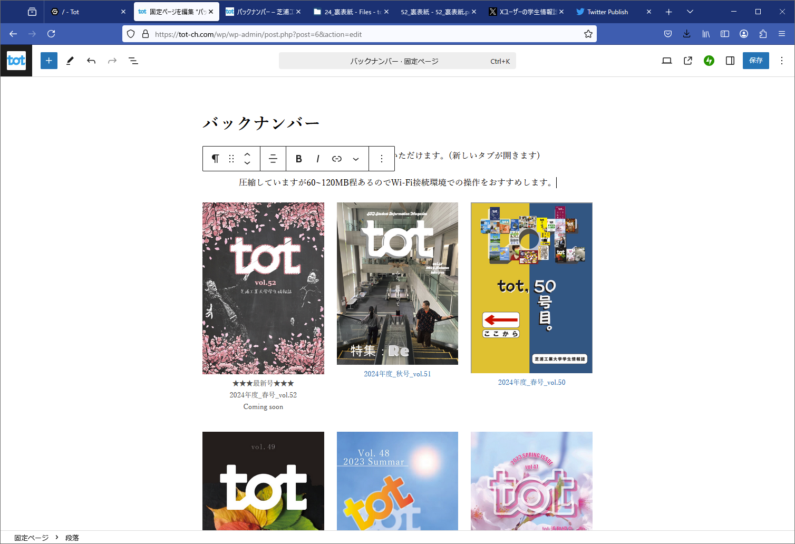
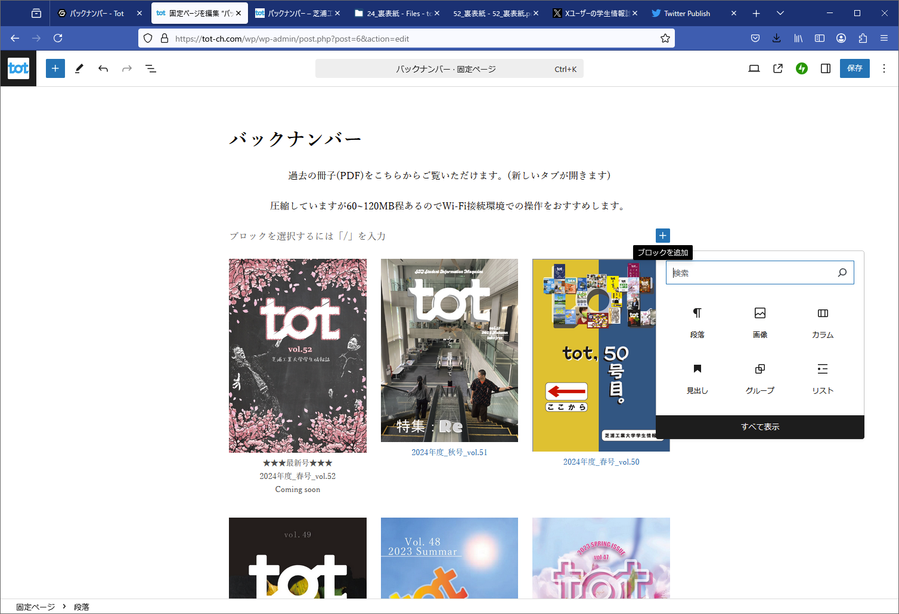
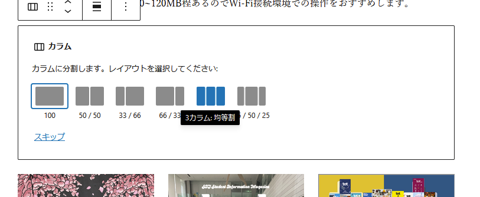
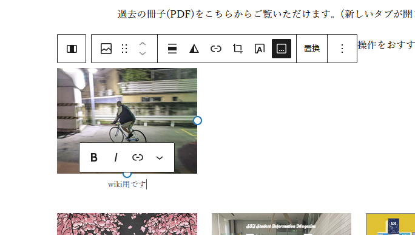
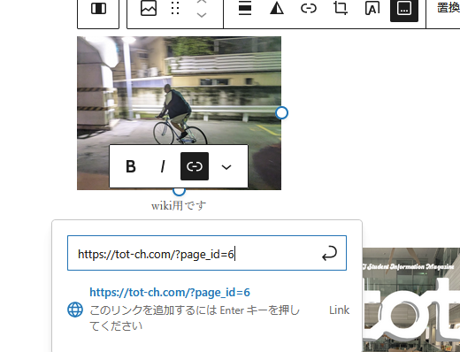
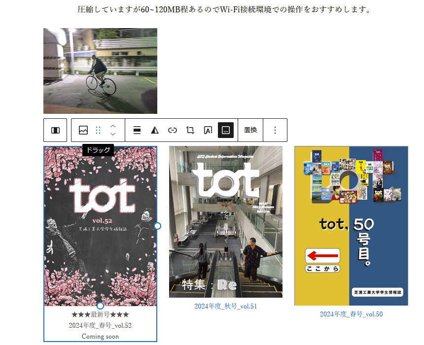
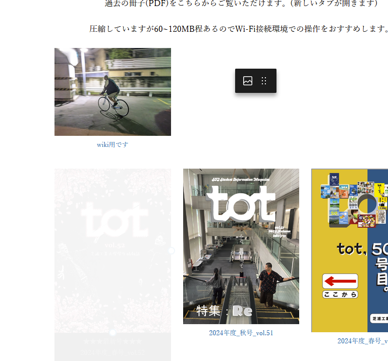
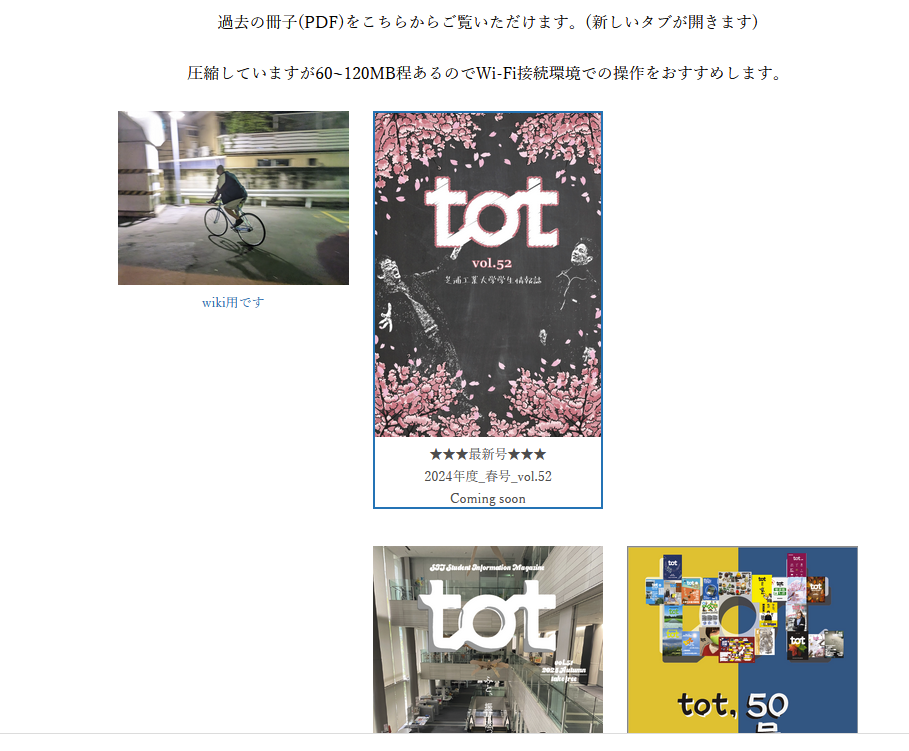

# バックナンバーの更新

まず、Adobe acrobatでバックナンバーのPDFファイルを一つに結合してください。
次に、WordPressのメディアライブラリに完成したPDFファイルをアップロードします。

## それが終わったら、、、

WordPressのバックナンバーページ（固定ページ）を編集していきます。

1.  **カラムの追加**
    「オススメします。」の下などで改行し、`ブロックを追加`ボタン（`+`アイコン）から`カラム`を選択し、`3カラム均等割`を選びます。

2.  **画像の挿入**
    追加したカラムのいずれかのブロックをクリックし、`画像`を選択して、表示したい号の表紙画像をアップロードまたはメディアライブラリから選択します。

3.  **キャプションとリンクの設定**
    挿入した画像にキャプション（例：「vol.53」など）を入力します。その後、入力したキャプションのテキストを選択し、ツールバーのリンクボタンから、先ほどアップロードしたPDFのURLを挿入します。

4.  **並び替え**
    WordPressでは、各ブロックをドラッグ＆ドロップで簡単に入れ替えることができます。新しく追加したカラムブロックを選択し、ツールバーの`⋮`の左にあるハンドル（サイコロの六の目のようなアイコン）をドラッグして、最新号が一番左に来るように並び替えます。

以下はWordPressの編集画面の例です。

