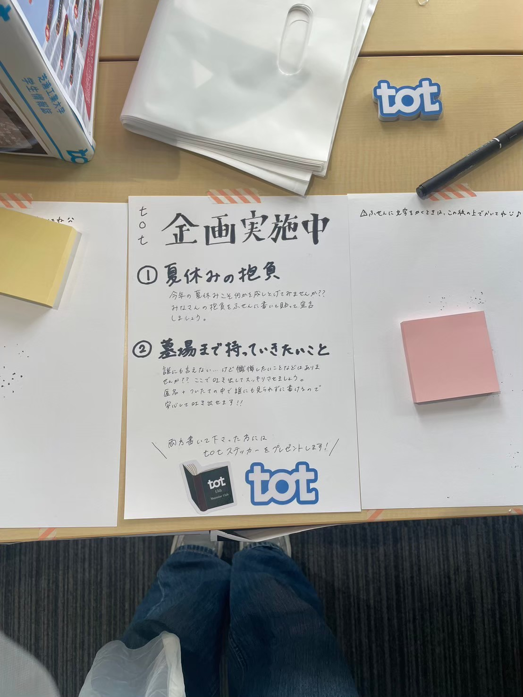
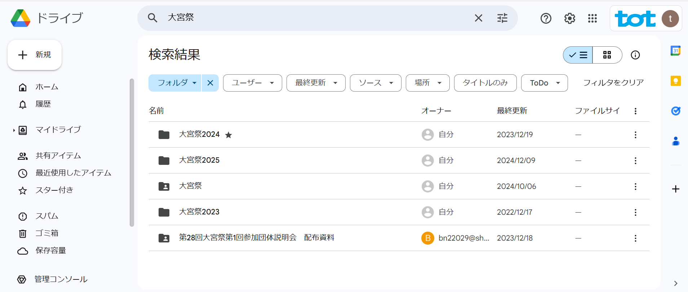

# 大宮祭

totは毎年5月ごろに開催される大宮祭で、主にtotの展示を中心に出展を行っています。

2023年は２号館の教室、2024年は廊下での展示を行いました。（教室が用意できず参加不可になりそうなところを廊下でもいいのでと交渉したら出展させてくださいました T T）

instagramで過去の大宮祭の様子を見ることができます。
https://www.instagram.com/tot_shibaura?utm_source=ig_web_button_share_sheet&igsh=ZDNlZDc0MzIxNw==

↓2024年は初の試みで企画をやりました。

大宮祭に参加する際は第一回説明会参加が必須となっています。
年にもよりますが、学内ポスター掲示やメールでの通知で説明会の通知が来るため情報を逃さないようにしましょう。

毎年芝祭終わりくらいに通知が来ることが多いです。

その後、何度かの説明会参加を経て大宮祭開催となります

定期的に提出物を求められます。企画書などの提出物関係以の記載に迷った場合は過去の大宮祭ファイルから参考にすることができます。
